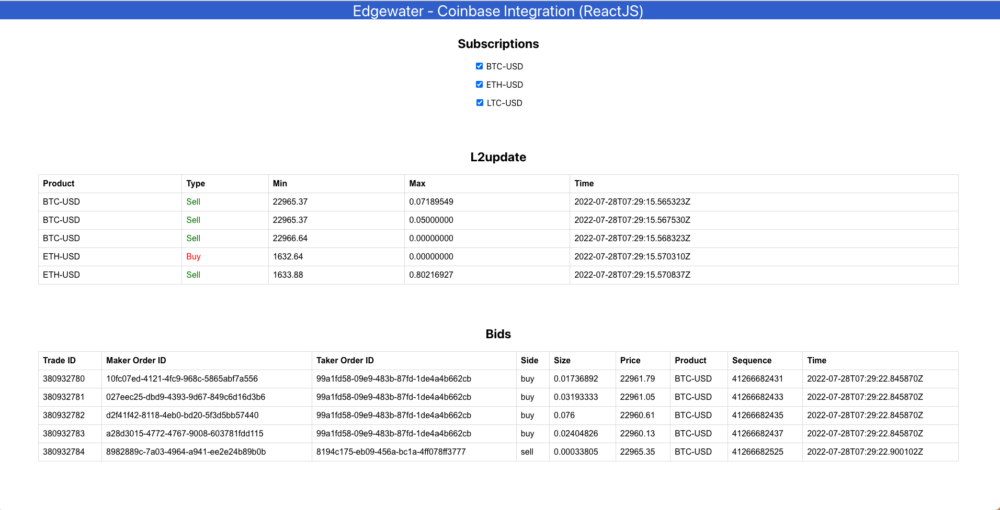
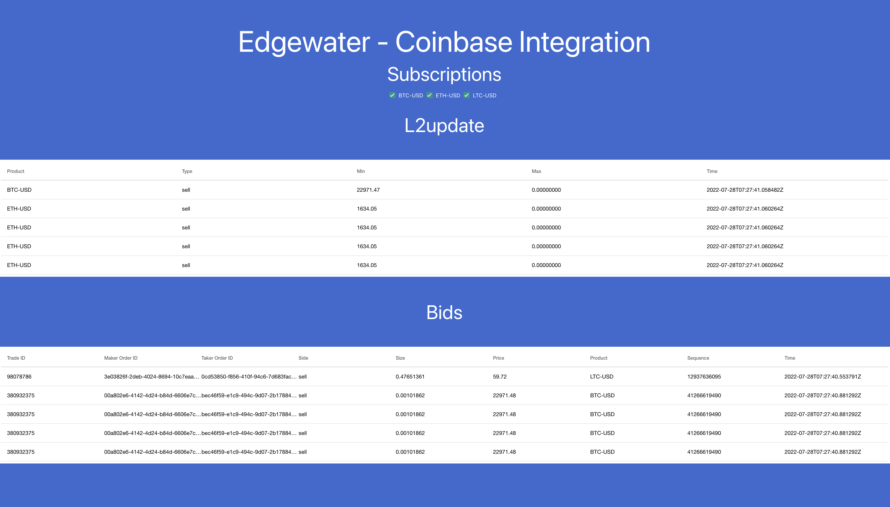

# Edgewater - Coinbase pro integration

# Project Structure
This project uses the following structure:

| Name                          | Description                         | 
| ----------------------------- | ------------------------------------| 
|coinbase           | coinbase server and websocket server           | 
|expo           | project created in expo and react native           | 
|react           | project created in react js          | 

# Getting started
- Navigate in to each folder and follow the approrpiate Readme

## Output

